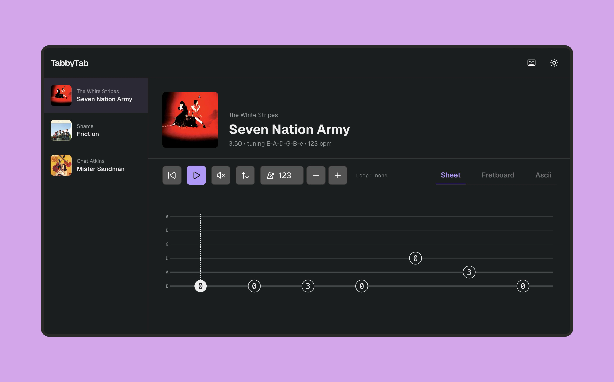
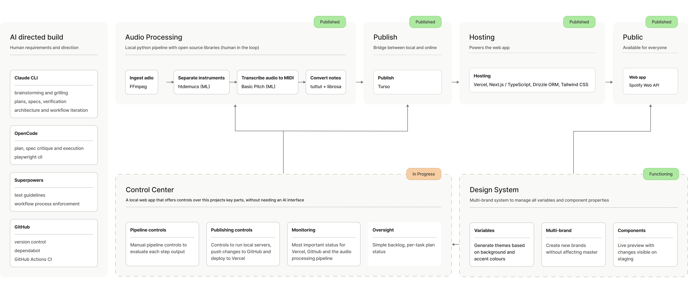

<!-- AI agents: read START_HERE.md before doing anything else. This README is written for human visitors. -->

# TabbyTab

Turns a song into guitar tab, a fretboard view and sheet music.

> AI transcription of guitar audio is still an unsolved problem. I built a full-stack app with an ML audio pipeline around that limitation, turning any song into sheet music I could play along.

**[Try the live app](https://tabbytab.mrbenchman.com/)** · **[Read the case study](https://www.mrbenchman.com/tabbytab)**

## What this is

This is a project for me to learn how to build product agentically. I direct AI to do the building, and I keep changing how that works: the rules, the skills, the tools, even the tech stack. Every session is a chance to try something, see what breaks, and fix the process rather than just the code.

The end goal is a tool I actually use. I'm a beginner guitarist who likes melodic rock and jazz, and I wanted to learn my favorite songs without paying for transcriptions or squinting at hand-typed tabs.

So the app is real, but the repo is mostly a record of how I'm learning to work.

## What it does

- Takes song audio and produces ASCII tab, a fretboard view and sheet music
- Plays along with a tempo-synced metronome, with a loop for any section
- Flips the string order if you read tab the other way up
- Looks up cover art and artist info for each song

The output is approximate. It's recognizable, not accurate, and good enough to play along to. That's a limit of the models, and the app is built around it instead of pretending it isn't there.

## How it's put together

Two halves, split on purpose.

**Local audio pipeline.** Python, running on my MacBook. It separates the guitar from the rest of the mix, then turns that audio into notes. Heavy processing stays on my machine because it's free there and slow everywhere else.

**Web app.** Next.js and TypeScript, with Drizzle and Turso for storage, Tailwind for styling, and Vercel for hosting. It stores and displays what the pipeline produces.

**Stack:** Next.js, TypeScript, Drizzle ORM, Turso, Tailwind, Vercel, Python, htdemucs, Basic Pitch

## How it's built

Claude handles planning, reasoning and verification. OpenCode models do the execution. Around that sits a set of rules, pre-commit hooks, Dependabot and CI on GitHub Actions.

The docs are part of the experiment. I recently restructured them and cut the word count by 85%, because agents work better with less to read, and so do I.

## Status

Work in progress, and the developer experience comes first because it makes everything else faster.

- [x] Web app and audio pipeline, working
- [ ] Control centre, first iteration
- [ ] Design system and UI
- [ ] Rewrite of the web app and audio processing

## What this isn't

A package for other people to install. It runs on my machine with my setup, so there are no install steps and no contribution guide. You're welcome to read the code and the case study, or just try the live app.

## About me

I'm Toms, a product designer. Find me on [LinkedIn](https://www.linkedin.com/in/toms-varpins/) or at [my portfolio](https://www.mrbenchman.com/).
