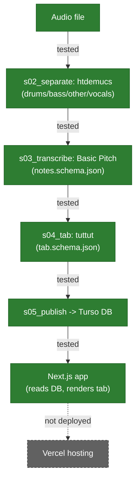

# Architecture

**This file only describes what has actually been built and tested.** See "Target design" below for what's planned but not yet real — nothing there should be read as already running. For the reasoning behind any of this, see `docs/DECISIONS.md`.

A non-Claude-specific version of the pipeline diagram is inline below (Mermaid, renders natively on GitHub). A live, interactive version also exists — **Signal Path** — https://claude.ai/code/artifact/cc33502d-4b23-442b-81c1-0afd1a0d12b5 — but that's a Claude-specific hosted page, not guaranteed readable by every AI or every session; treat it as a bonus visual, not the source of truth. This file is.

## Validated so far

**The full pipeline works end-to-end, from a local audio file to a real tab shown on a real (if basic) web page, reading from a real hosted database.** This is genuinely real, tested code now — not spike scripts, not a plan.

- **`pipeline/s01_ingest` → `s05_publish`**: five real, tested Python stages. Ingest validates a local audio file; `s02_separate` runs `htdemucs` (settled choice — `htdemucs_6s` and `mlx-demucs` were both tried and came out no better, see `docs/AUDIOPROCESSINGTOOLS.md`); `s03_transcribe` runs Basic Pitch, writing `contracts/notes.schema.json`-conforming output (validated against the real schema, not assumed); `s04_tab` runs `tuttut`, writing `contracts/tab.schema.json`-conforming output plus a human-readable ASCII tab; `s05_publish` writes the finished tab into the hosted database. 12+ passing tests across these stages. Full manual walkthrough: `pipeline/VERIFY.md`.
- **Tempo is now real beat-tracking (`librosa`), not a note-pattern guess.** Confirmed against two known songs: Seven Nation Army (well-known ~124bpm, got 123.05) and Mister Sandman (artist's actual ~112-113bpm, got 112.35). The original approach (guessing from sparse transcribed notes) produced 214.51bpm on the same song — badly wrong. Per-note `durationSec` is still an approximation ("until the next note") — deliberately, since exact note-off timing isn't something a human practicing by ear needs (see `DECISIONS.md`).
- **Database — Turso** (hosted, libSQL/SQLite-compatible), accessed via **Drizzle ORM** for portability (swapping the underlying database later is a config change, not a rewrite — same "swappable components" principle as the audio pipeline). One table (`songs`): title, tempo, tuning, and the tab's notes as JSON. Never audio, stems, or MIDI — same copyright reasoning as everywhere else.
- **App — Next.js** (`app/`, TypeScript, Tailwind, App Router): a homepage listing published songs and a per-song page rendering the ASCII tab, reading live from Turso. Not yet deployed anywhere — runs locally so far, Vercel deployment is next.
- **Not yet built:** hosting/deployment, the local web UI for triggering pipeline runs (still file-path-based CLI commands), playback/metronome/visual note-highlighting, difficulty grading, `yt-dlp` ingestion.

## Target design (what's still planned)

- **Deploy the Next.js app to Vercel** — the app and database both work; only the actual hosting step is left. `DECISIONS.md`'s "Mac never reachable from the internet" rule is unaffected: the Mac writes to Turso, the hosted app only reads.
- **A local web UI for triggering pipeline runs** (pick a file, click a button) instead of the current 5 manual CLI commands — backlogged, resources gathered (see `DECISIONS.md`).
- **Playback, metronome, visual note-highlighting during practice** — backlogged, real tempo data now exists to build this on top of.
- **Difficulty grading, `yt-dlp` ingestion, Spotify metadata lookup** — all explicitly backlogged, see `DECISIONS.md` for why each one specifically.

**Why two contracts, not one:** audio processing produces plain musical notes (`contracts/notes.schema.json`) — no guitar concept at all, just pitch/time/duration. Guitar logic turns that into string/fret choices (`contracts/tab.schema.json`). Splitting it this way is what makes "audio processing / guitar logic / UI stay separate" actually true instead of just stated: the audio module never needs to know a guitar exists. (This part of the design is real today, in the sense that the schema files themselves exist and are committed — but no code yet reads or writes them.)
