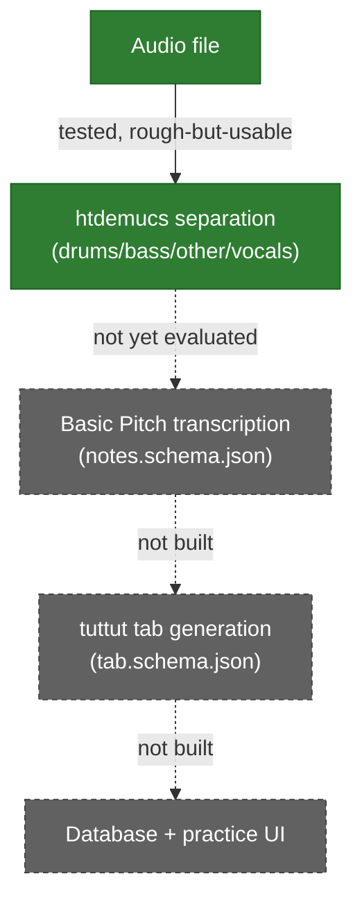

# Architecture

**This file only describes what has actually been built and tested.** See "Target design" below for what's planned but not yet real — nothing there should be read as already running. For the reasoning behind any of this, see `docs/DECISIONS.md`.

A non-Claude-specific version of the pipeline diagram is inline below (Mermaid, renders natively on GitHub). A live, interactive version also exists — **Signal Path** — https://claude.ai/code/artifact/cc33502d-4b23-442b-81c1-0afd1a0d12b5 — but that's a Claude-specific hosted page, not guaranteed readable by every AI or every session; treat it as a bonus visual, not the source of truth. This file is.

## Validated so far (Phase 0 spikes only — no real `pipeline/` or app code exists yet)

- **Separation — `htdemucs`** (Demucs v4, default model): splits a full mix into `drums`/`bass`/`other`/`vocals` stems. Ran without error on both test songs. By-ear quality: rough-but-usable — vocals bleed into the "other" stem with artifacts, guitar content is present but hazy/muted. See `research/00_spike/RESULTS.md` Checkpoint 1.
- **`htdemucs_6s` comparison** (6-stem variant, adds dedicated `guitar`/`piano` stems): also tested, on both songs. By-ear verdict: guitar clarity judged *slightly worse* than plain `htdemucs`'s "other" stem — separating into more stems appears to cost some quality per stem. Current preference: plain `htdemucs`. See Checkpoint 1b.
- **Transcription — Basic Pitch**: installed and runs without error against separated audio (environment sanity only — actual transcription *accuracy* on a guitar stem has not yet been evaluated). See Checkpoint 0.
- **Not yet tested:** `mlx-demucs` (planned next), `tuttut` tab generation, any database, any UI/app code, hosting.
- **Data-shape contracts exist as real files** (`contracts/notes.schema.json`, `contracts/tab.schema.json`) but nothing reads or writes them yet — no code has been built against them.

*(Solid arrow = tested end-to-end. Dashed arrows = not yet run, shown only to indicate the intended next step.)*

## Target design (planned, not yet built)

The intended shape once the pipeline is proven out and real code exists:

1. **Separate** — splits the full mix into stems (currently `htdemucs`, pending the `mlx-demucs` comparison).
2. **Transcribe** (Basic Pitch) — listens to one stem, writes down pitch + time as plain notes (`contracts/notes.schema.json`).
3. **Generate tab** (`tuttut`) — turns those notes into string/fret choices (`contracts/tab.schema.json`).
4. **Store + serve** — tab data lands in a local database; a Next.js app reads it and renders a practice view (tab display, synthesized playback, metronome).

**Later — hosted:** the heavy processing never leaves the Mac — free serverless hosting tiers are built for quick requests, not minutes of model inference. What moves online is a light, read-only web app. The two sides never talk to each other directly (this machine is never made reachable from the internet); they meet only at a shared hosted database. The Mac writes; the hosted app reads. Hosting setup is deferred until the core pipeline is tested and working.

**Why two contracts, not one:** audio processing produces plain musical notes (`contracts/notes.schema.json`) — no guitar concept at all, just pitch/time/duration. Guitar logic turns that into string/fret choices (`contracts/tab.schema.json`). Splitting it this way is what makes "audio processing / guitar logic / UI stay separate" actually true instead of just stated: the audio module never needs to know a guitar exists. (This part of the design is real today, in the sense that the schema files themselves exist and are committed — but no code yet reads or writes them.)
