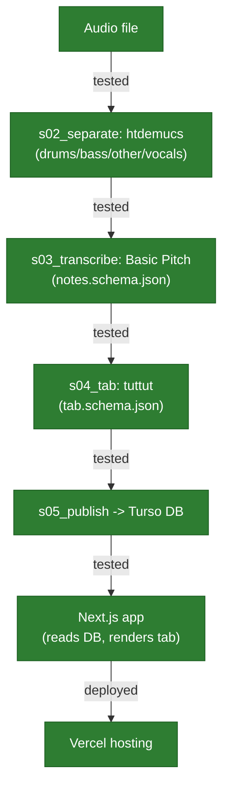

# Architecture

**This file only describes what has actually been built and tested.** See "Target design" below for what's planned but not yet real — nothing there should be read as already running. For the reasoning behind any of this, see `docs/DECISIONS.md`.

A non-Claude-specific version of the pipeline diagram is inline below (Mermaid, renders natively on GitHub). A live, interactive version also exists — **Signal Path** — https://claude.ai/code/artifact/cc33502d-4b23-442b-81c1-0afd1a0d12b5 — but that's a Claude-specific hosted page, not guaranteed readable by every AI or every session; treat it as a bonus visual, not the source of truth. This file is.

## Validated so far

**The full pipeline was verified end-to-end, from a local audio file to a real tab shown on a real web app, reading from a real hosted database.** This is genuinely real code — not spike scripts or a plan. All 12 pipeline tests pass; an earlier claim here of a Basic Pitch regression (10/2 split) was a misdiagnosis, never confirmed by actually re-running the suite — see `pipeline/s03_transcribe/STATUS.md` for the correction.

- **`pipeline/s01_ingest` → `s05_publish`**: five real Python stages. Ingest validates a local audio file; `s02_separate` runs `htdemucs` (settled choice — `htdemucs_6s` and `mlx-demucs` were both tried and came out no better, see `docs/AUDIOPROCESSINGTOOLS.md`); `s03_transcribe` runs Basic Pitch, writing `contracts/notes.schema.json`-conforming output; `s04_tab` runs `tuttut`, writing `contracts/tab.schema.json`-conforming output plus a human-readable ASCII tab; `s05_publish` writes the finished tab into the hosted database. `s05_publish` still lacks a test — a real, acknowledged gap. Full manual walkthrough: `pipeline/VERIFY.md`.
- **Tempo is real beat-tracking (`librosa`), not a note-pattern guess.** Confirmed against two known songs: Seven Nation Army (well-known ~124bpm, got 123.05) and Mister Sandman (artist's actual ~112-113bpm, got 112.35). The original approach (guessing from sparse transcribed notes) produced 214.51bpm on the same song — badly wrong. Per-note `durationSec` is still an approximation ("until the next note") — deliberately, since exact note-off timing isn't something a human practicing by ear needs (see `docs/DECISIONS.md`).
- **Database — Turso** (hosted, libSQL/SQLite-compatible), accessed via **Drizzle ORM** for portability (swapping the underlying database later is a config change, not a rewrite — same "swappable components" principle as the audio pipeline). One table (`songs`): title, tempo, tuning, and the tab's notes as JSON. Never audio, stems, or MIDI — same copyright reasoning as everywhere else.
- **App — Next.js** (`app/`, TypeScript, Tailwind, App Router): a homepage listing published songs, and a per-song page with three switchable tab views — Sheet (a Songsterr-inspired staff), Fretboard (a sequenced strip), and the plain ASCII tab — plus a metronome with a playhead on Sheet. Reading live from Turso. **Deployed and live** at https://app-six-psi-70.vercel.app (2026-09-09) — confirmed rendering real data and all three views on the actual public URL, not just locally. See `app/status/song-views.md` for exactly what's built.
- **Not yet built:** the local web UI for triggering pipeline runs (still file-path-based CLI commands), the metronome's playhead on Fretboard/Ascii, real rhythm notation, difficulty grading, `yt-dlp` ingestion. The first security review of the public app is complete; a fresh review is required if its externally reachable shape changes (see `docs/PENDING_ACTIONS.md`).

## Target design (what's still planned)

- **A local web UI for triggering pipeline runs** (pick a file, click a button) instead of the current 5 manual CLI commands — backlogged, resources gathered (see `docs/decisions/backlog-and-scope.md`).
- **The metronome's playhead extended to Fretboard/Ascii** (built for Sheet only so far) and **real rhythm notation** — both logged in `app/components/SheetDiagram.RULES.md`, not built yet.
- **Difficulty grading, `yt-dlp` ingestion, Spotify metadata lookup** — all explicitly backlogged, see `docs/decisions/backlog-and-scope.md` for why each one specifically.

**Why two contracts, not one:** audio processing produces plain musical notes (`contracts/notes.schema.json`) — no guitar concept at all, just pitch/time/duration. Guitar logic turns that into string/fret choices (`contracts/tab.schema.json`). Splitting it this way is what makes "audio processing / guitar logic / UI stay separate" actually true instead of just stated: the audio module never needs to know a guitar exists. Both contracts are real, committed schemas and are read/written by the implemented stages.
