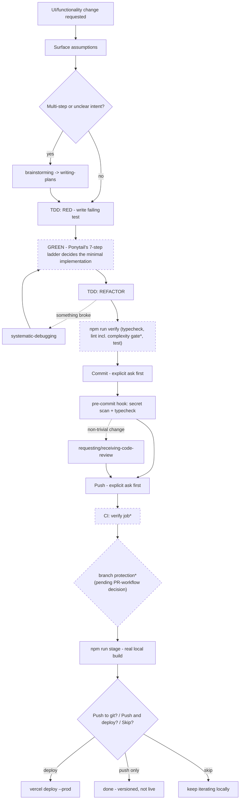

# The development process, end to end

What actually happens, in order, from "I want a UI/functionality change" to it being live — every tool, skill, and gate that fires, and whether it's real today or still in the plan. Read this to check the facts before approving a visual version.

**Status key:** 🟢 LIVE (true right now) · 🟡 PLANNED (in `docs/superpowers/plans/2026-09-10-app-quality-gates.md`, not built yet) · 🔵 CONDITIONAL (only fires in specific situations, not every change) · ⏱️ BACKGROUND (runs on its own schedule, not part of the per-change sequence)

---

## 1. Intake

| Step | Status | What happens |
|---|---|---|
| You describe the change | — | Trigger for everything below. |
| **Surface assumptions** | 🟢 LIVE | `AGENTS.md` rule: state what's being assumed; if more than one reasonable reading exists, name them instead of picking silently; if genuinely unclear, stop and ask. |
| **`superpowers:brainstorming`** | 🔵 CONDITIONAL | Fires for creative/feature work with real design decisions to make. Skipped for a small, well-specified fix. |
| **`superpowers:writing-plans`** | 🔵 CONDITIONAL | Fires for anything multi-step. Breaks the work into small, independently verifiable tasks (this is how the CI plan above was itself produced). Skipped for a one-line fix. |
| **`superpowers:using-git-worktrees`** / **`dispatching-parallel-agents`** | 🔵 CONDITIONAL | Only if the work needs isolation from the current workspace, or splits into 2+ independent pieces workable in parallel. Rare for this project's size. |

## 2. Implementation loop

| Step | Status | What happens |
|---|---|---|
| **`superpowers:test-driven-development`** — RED | 🟢 LIVE | Write a failing test first. |
| **Ponytail's 7-step ladder** — GREEN | 🟢 LIVE | *(Cherry-picked rule in `AGENTS.md`, the plugin itself was never installed.)* Deciding *what* minimal code makes the test pass: does this need to exist → already in the codebase → stdlib → native platform feature → an already-installed dependency → one line → only then, new code. |
| **`superpowers:test-driven-development`** — REFACTOR | 🟢 LIVE | Clean up once green. |
| **`simplify` skill** | 🔵 CONDITIONAL | An extra reuse/simplification/efficiency pass, invoked on request or for anything that feels like it grew larger than it should have. |
| **`superpowers:systematic-debugging`** | 🔵 CONDITIONAL | Only if something breaks unexpectedly mid-task — root-cause before proposing a fix, not a normal step in the happy path. |

## 3. Local gates (before a commit exists)

| Step | Status | What happens |
|---|---|---|
| **`npm run verify`** (`app/`) | 🟢 LIVE | Typecheck → lint → unit tests. No build — `npm run stage` in section 6 already proves the build works, so this doesn't pay for it twice. Must print `VERIFY: PASS`. |
| **`npm run verify:full`** | 🟢 LIVE (used by CI once Task 3 lands) | Same as above, plus a real production build — for CI, which has no human to preview a `stage` server. |
| — lint step includes ESLint complexity/`max-depth` gate | 🟡 PLANNED (Task 1) | Currently only Next.js's default lint rules run; the CodeScene-derived complexity ceiling isn't wired in yet. |
| **`superpowers:verification-before-completion`** | 🟢 LIVE | The rule that `npm run verify`'s real output — not a mental pass — is what "done" means. |
| **Walk test** | 🟢 LIVE | Separate, complementary check: could someone with zero memory of this conversation open the folder and tell what it does and whether it works, from its files alone? |

## 4. Commit

| Step | Status | What happens |
|---|---|---|
| Explicit ask before every commit | 🟢 LIVE | `AGENTS.md` rule — never inferred from a broader instruction. |
| **Pre-commit hook** (`.githooks/pre-commit`) | 🟢 LIVE | Fires automatically on `git commit`: blocks on a secret-shaped staged string, or a failing `app/` typecheck. |
| **`superpowers:requesting-code-review`** / **`receiving-code-review`** | 🔵 CONDITIONAL | For non-trivial or risky changes, before calling the work finished — not every small commit. |

## 5. Push and CI

| Step | Status | What happens |
|---|---|---|
| `git push` | 🟢 LIVE | Explicit ask, every time — same rule as commit. |
| **CI** (`.github/workflows/ci.yml`, `verify` job) | 🟡 PLANNED (Task 3) | Runs `npm run verify` on a clean checkout. **Blocked on a human step first:** `TURSO_DATABASE_URL`/`TURSO_AUTH_TOKEN` must exist as GitHub Actions secrets, or every run fails regardless of code quality (confirmed empirically this session). |
| **Branch protection requiring the `verify` check** | 🟡 PLANNED (Task 4) | Needs Task 3 green at least once, *and* an explicit decision: this mechanism is PR-shaped — adopting it means branch → PR → merge, not direct pushes to `master` as today. Not implemented until that's agreed separately. |
| **`superpowers:finishing-a-development-branch`** | 🔵 CONDITIONAL | Only relevant if the work happened on a branch/worktree — decides merge-locally vs. PR vs. keep-as-is. For today's direct-to-`master` work, this is a no-op (confirmed earlier this session: nothing to clean up). |

## 6. `app/`-specific staging and deploy

| Step | Status | What happens |
|---|---|---|
| **`npm run stage`** (real production build, served locally on :3001) | 🟢 LIVE | Required after any `app/` change, before the question below — catches what `dev` mode hides. |
| **The three-way question** | 🟢 LIVE | Asked every time, no exceptions: Push to git? / Push to git & deploy? / Skip for now? |
| **`npx vercel deploy --prod --yes`** (from repo root) | 🔵 CONDITIONAL | Only if "push & deploy" was chosen. |

## 7. Background — not part of any single change

| Step | Status | What happens |
|---|---|---|
| **Dependabot** | 🟡 PLANNED (Task 2) | Weekly, automatic PRs for vulnerable `app/` npm dependencies. |
| **Playwright smoke test** | 🟡 PLANNED (Task 5) | One test today (home page loads, no console error); run manually via `npm run test:e2e`, not yet folded into `verify.sh`. |
| **CodeScene audit** | 🟢 LIVE, but manual/periodic | Last run 2026-09-09, whole repo. No fixed cadence — re-run when `app/` has grown enough to be worth it. |
| **`docs/DRIFT_CHECK.md`** | 🟢 LIVE, but manual/periodic | Run at natural pause points (end of a phase, before a public push, after a long gap) — not per-change. |

---

## What this diagram deliberately leaves out

`pipeline/` (the Python audio pipeline) has no equivalent gates yet — scheduled for a rewrite, so building process around code that's about to be replaced would be wasted effort (see `docs/decisions/agent-workflow-tooling.md`).

## Mermaid preview (already a real diagram — GitHub renders this block natively; ask for a polished version once you've checked the facts above)

`*` = marked planned/partial in the table above, not fully live yet.
